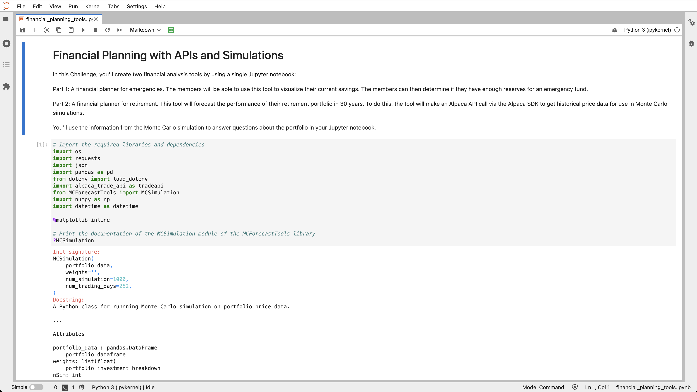

# Challenge 5 - Financial Planning Tools
Two tools for use in determining a member's savings sufficiency for an emergency fund and for determining the performance of a 30-year retirement portfolio using Monte Carlo simulation. 

---
## Technologies
Financial Planning Tools uses **Jupyter Lab** to run the program, and the included **MC ForecastTools** to run the Monte Carlo simulations. It also uses the following imports:
```python
import os
import requests
import json
import pandas as pd
from dotenv import load_dotenv
import alpaca_trade_api as tradeapi
from MCForecastTools import MCSimulation
import numpy as np
import datetime as datetime

%matplotlib inline
```
---
## Installation Guide
First, install the following on the **dev** environment:
```
conda install -c anaconda requests
```
```
conda install -c jmcmurray json
```


---
## Usage
Navigate to the folder that contains this file in GitBash or Terminal for Mac. Run the following:
```
jupyter lab financial_planning_tools.ipynb
```
It will open the user interface in a new window on your browser.


---
## Contributors
Heeje Yoo - heeje90@pm.me

---
## License
Copyright 2022 Heeje Yoo

Permission is hereby granted, free of charge, to any person obtaining a copy of this software and associated documentation files (the "Software"), to deal in the Software without restriction, including without limitation the rights to use, copy, modify, merge, publish, distribute, sublicense, and/or sell copies of the Software, and to permit persons to whom the Software is furnished to do so, subject to the following conditions:

The above copyright notice and this permission notice shall be included in all copies or substantial portions of the Software.

THE SOFTWARE IS PROVIDED "AS IS", WITHOUT WARRANTY OF ANY KIND, EXPRESS OR IMPLIED, INCLUDING BUT NOT LIMITED TO THE WARRANTIES OF MERCHANTABILITY, FITNESS FOR A PARTICULAR PURPOSE AND NONINFRINGEMENT. IN NO EVENT SHALL THE AUTHORS OR COPYRIGHT HOLDERS BE LIABLE FOR ANY CLAIM, DAMAGES OR OTHER LIABILITY, WHETHER IN AN ACTION OF CONTRACT, TORT OR OTHERWISE, ARISING FROM, OUT OF OR IN CONNECTION WITH THE SOFTWARE OR THE USE OR OTHER DEALINGS IN THE SOFTWARE.